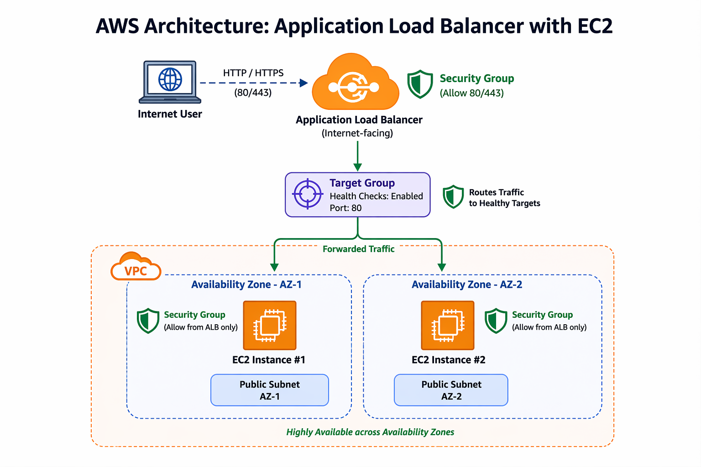

# AWS Application Load Balancer with EC2 (High Availability)

## 📌 Project Overview
This project demonstrates how to build a **highly available web application** on AWS using an **Application Load Balancer (ALB)** and **multiple EC2 instances** deployed across **multiple Availability Zones**.

Instead of relying on a single server, incoming HTTP traffic is distributed across multiple EC2 instances, improving **fault tolerance, reliability, and scalability**.

---

## 🎯 Project Objectives
- Deploy multiple EC2 instances to host a web application  
- Configure an Application Load Balancer to distribute traffic  
- Implement health checks using a target group  
- Achieve high availability using Multi-AZ architecture  

---

## 🛠️ AWS Services Used
- **Amazon EC2** – Virtual servers to host the web application  
- **Application Load Balancer (ALB)** – Distributes incoming HTTP traffic  
- **Target Groups** – Routes traffic to healthy EC2 instances  
- **Amazon VPC** – Isolated networking environment  
- **Public Subnets (Multi-AZ)** – Ensures high availability  
- **Internet Gateway** – Enables internet access  
- **Security Groups** – Controls inbound and outbound traffic  
- **Apache Web Server** – Serves HTTP requests  

---

## 🏗️ Architecture

The architecture follows a real-world production design:

- Internet-facing Application Load Balancer  
- Target Group with health checks  
- Two EC2 instances deployed in different Availability Zones  
- Public subnets connected through an Internet Gateway  

📌 Architecture diagram is available in the `architecture/` folder.

---

## ⚙️ Implementation Summary
1. Launched two EC2 instances in different Availability Zones  
2. Installed and configured Apache web server on both instances  
3. Created a target group with HTTP health checks  
4. Registered EC2 instances to the target group  
5. Created an internet-facing Application Load Balancer  
6. Configured listener rules to forward traffic to the target group  
7. Verified traffic distribution using the ALB DNS name  

---

## ✅ Results
- Application Load Balancer successfully distributes traffic  
- Requests are served alternately by EC2 instances  
- Target group health checks show all instances as **Healthy**  
- High availability and fault tolerance achieved  

---

## 📸 Screenshots
Step-by-step screenshots showing configuration and results are available in the `screenshots/` folder.

---

## 🎥 Demo Video
A demo video showing live load balancing is available in the `demo/` folder.

---

## 🚀 Key Learnings
- Difference between single-instance and load-balanced architecture  
- Importance of health checks and Availability Zones  
- Practical understanding of ALB and target groups  
- Real-world AWS networking and security concepts  

---

## 🔮 Future Enhancements
- Integrate Auto Scaling Group (ASG)  
- Enable HTTPS using AWS Certificate Manager (ACM)  
- Add monitoring and alarms using Amazon CloudWatch  

---

## 👤 Author
**Adhithyan Sivaraman T**  
AWS & Cloud Computing Enthusiast
